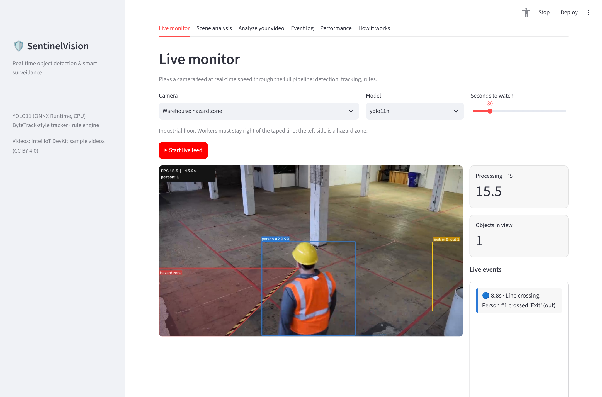
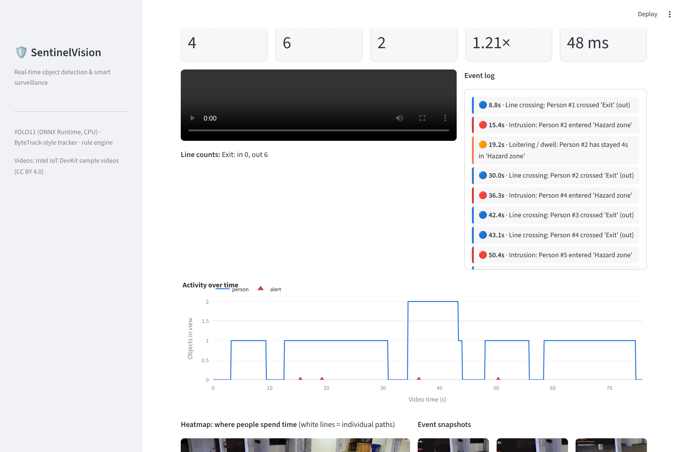
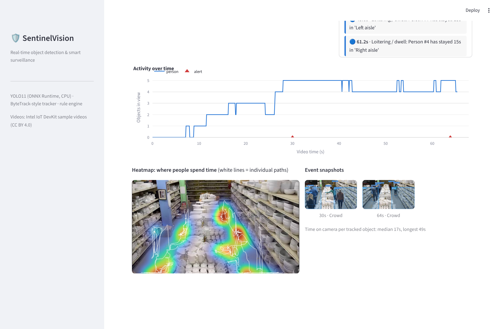

# SentinelVision: Real-Time Object Detection & Smart Surveillance

SentinelVision turns a camera feed into **security and operations events**. It detects people
and vehicles, tracks them across frames, and applies rules: **restricted-zone intrusion,
loitering, directional line counting, crowding and stopped vehicles**. Every event is logged
with a snapshot, and you get an annotated video, an activity timeline and a heatmap.

It runs **faster than real time on a laptop CPU**: no GPU, no PyTorch, no cloud API.



## Results

| | |
|---|---|
| Detector accuracy (YOLO11n, COCO128) | **mAP50 0.671** / mAP50-95 0.504 (official evaluator: 0.674 / 0.505) |
| Detector speed (2-core CPU, ONNX Runtime) | **25 FPS** for any input size up to 1080p |
| Full pipeline (detect + track + rules + drawing) | **1.2× to 2.1× faster than real time** on the 5 test scenes |
| People counting (hallway scene) | **7/7 people counted, 4 west / 3 east: exact match** with the manual count |
| Tracking + rules cost | **< 1 ms per frame** (inference is ~90% of the time) |

| Model | mAP50 | mAP50-95 | Person AP50 | CPU FPS (720p) | Size |
|---|---|---|---|---|---|
| YOLO11n | 0.671 | 0.504 | 0.785 | **24.9** | 10 MB |
| YOLO11s | 0.731 | 0.569 | 0.820 | 10.5 | 36 MB |

YOLO11n is the default: it's 2.4× faster for 6 points of mAP, which is the right trade-off for
real time on a CPU. YOLO11s can be selected anywhere in the app.

> **Why reproduce the official mAP?** The pre-processing (letterbox), output decoding and
> non-maximum suppression are written by hand, not taken from a library. Matching the official
> evaluator to within 0.003 mAP proves the implementation is correct. (YOLO11s is 0.012 lower
> because the official validator assigns multiple labels per box; I keep one label per box, as
> production inference does.) COCO128 images come from COCO *train*, so absolute mAP is
> optimistic. It's used here as a correctness check, not a benchmark claim.

## The 5 test scenes

Real surveillance-style footage from Intel's
[sample-videos](https://github.com/intel-iot-devkit/sample-videos) (CC BY 4.0).

| Scene | Rules | What happens |
|---|---|---|
| **Warehouse** (1080p) | Hazard-zone intrusion, loitering, exit counting | 3 workers cross into the taped hazard area: 3 critical alerts, 1 loitering |
| **Store aisles** | Dwell time per aisle, crowding | Shoppers who stay over 15 s, crowd warnings when 5 people are in the aisle |
| **Parking lot** | Car lane + bike-path counting, stopped vehicles | Bikes, pedestrians and cars counted by direction |
| **Hallway** | Two exit tripwires, group detection | Exact people count per exit |
| **Office** | Restricted door area | Each person entering the restricted area raises an alert |

| Scene analysis | Heatmap & timeline |
|---|---|
|  |  |

## Features

- **Live monitor**: plays a camera feed through the full pipeline at real-time speed, with live event feed
- **Your own video**: upload a clip, draw a restricted zone and a counting line, get the full analysis
- **Rules engine**: intrusion (with persistence, so one-frame flicker doesn't alert), loitering/dwell,
  directional line crossing (counts only real crossings of the segment), crowd (duration + cooldown),
  stopped vehicles
- **Outputs**: annotated H.264 video (plays in any browser), event log with snapshots (SQLite),
  activity timeline, heatmap of where people spend time, dwell times
- **Webcam / RTSP**: `python -m sentinel.pipeline --webcam 0` opens a live window on your machine
- **REST API**: image detection, background video jobs with progress, event queries, and a live
  **MJPEG stream** you can open in any browser tab
- **Privacy by design**: no face recognition, no identity. Track IDs are anonymous and reset when
  someone leaves the frame.

## How it works

```
 video / webcam ─▶ YOLO11 (ONNX Runtime) ─▶ ByteTrack-style tracker ─▶ rules engine ─▶ events (SQLite + snapshots)
                   letterbox · decode · NMS    Kalman filter + Hungarian    zones · lines · timers       │
                                                                                                         ▼
                                               annotated H.264 video · timeline · heatmap · API · dashboard
```

1. **Detection**: YOLO11 exported once to ONNX, run with ONNX Runtime. Low confidence threshold
   (0.15): the tracker decides what's real.
2. **Tracking**: each object gets a constant-velocity **Kalman filter**. Detections are matched to
   tracks with the **Hungarian algorithm** on IoU in **two passes**: confident boxes first, then weak
   boxes to keep partly occluded people (the ByteTrack idea). New tracks need 3 hits before they get
   an ID, which removes one-frame false positives.
3. **Rules** run on each track's **ground point** (bottom-center of the box), the point that
   actually stands in a zone. Geometry is in **normalized coordinates**, so a configuration works at
   any resolution.
4. **Frame skipping**: a 60 FPS camera is analyzed at 10 FPS. The tracker bridges the gaps, which
   cuts compute by 6× with no loss for human-speed motion.

## Getting started (Windows / VS Code)

```powershell
python -m venv .venv
.venv\Scripts\activate
pip install -r requirements.txt
python -m sentinel.data             # download the 5 sample videos (36 MB)

streamlit run dashboard/app.py      # dashboard → http://localhost:8501
python -m sentinel.pipeline --scene warehouse --show   # live window
python -m sentinel.pipeline --webcam 0                  # your webcam (press q to quit)
uvicorn api.main:app --reload       # API → http://127.0.0.1:8000/docs
pytest                              # 29 tests
```

In VS Code, the **Run and Debug** panel (Ctrl+Shift+D) has one-click configurations, including
the webcam. With Docker: `docker compose up --build`.

## API

| Method | Endpoint | Purpose |
|---|---|---|
| POST | `/detect/image` | Detect objects in an image (JSON, or annotated JPEG) |
| POST | `/jobs` | Analyze a video (preset scene or upload) in the background |
| GET | `/jobs/{id}` | Progress, status and summary |
| GET | `/jobs/{id}/video`, `/jobs/{id}/report` | Annotated MP4, full JSON report |
| GET | `/events` | Query the event log (filter by job, type, severity) |
| GET | `/stream/{scene}` | **Live MJPEG stream**: open it in a browser tab |
| GET | `/scenes`, `/model-info`, `/health` | Scene configs, benchmark, status |

## Project structure

```
SentinelVision/
├── sentinel/
│   ├── detector.py     # ONNX YOLO: letterbox, decoding, class-aware NMS
│   ├── tracker.py      # Kalman filter + two-pass Hungarian association
│   ├── rules.py        # zones, tripwires, intrusion/loitering/crossing/crowd/stopped-vehicle rules
│   ├── scenes.py       # scene configurations (JSON-serializable)
│   ├── pipeline.py     # video → events + annotated video; CLI with live window/webcam
│   ├── annotate.py     # drawing
│   ├── events.py       # SQLite event store
│   ├── evaluation.py   # mAP (COCO-style) + speed benchmark
│   ├── demo.py         # pre-computes the dashboard demo
│   └── data.py         # sample video download
├── api/main.py         # FastAPI (jobs, events, MJPEG stream)
├── dashboard/app.py    # Streamlit
├── models/             # yolo11n.onnx, yolo11s.onnx
├── data/demo/          # pre-computed results for the 5 scenes
├── reports/            # detector benchmark
└── tests/              # 29 tests incl. end-to-end people counting
```

## Limitations & next steps

- **Re-identification**: someone who leaves and comes back gets a new ID (counts are per pass,
  not per unique person). Next step: an appearance embedding (e.g. OSNet) for re-ID.
- **Cyclists** are detected as both a bicycle and a person; a rider-merging step would count them
  once.
- **Pretrained COCO classes only**: safety-specific detection (helmets, vests) would need
  fine-tuning on a labelled dataset.
- Zones are drawn per camera; perspective is not modelled (no real-world distances or speeds).
- Evaluation of tracking uses one manually counted scene. A full benchmark would use MOT17
  (HOTA/IDF1).

## Credits

Sample videos: [Intel IoT DevKit sample-videos](https://github.com/intel-iot-devkit/sample-videos) (CC BY 4.0).
Detector: [Ultralytics YOLO11](https://github.com/ultralytics/ultralytics) weights (AGPL-3.0) exported to ONNX.
